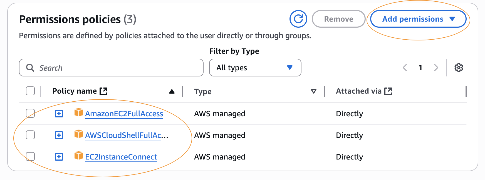

# 🚀 DevOps Self-Lab Project: AWS EC2 Infrastructure & Tool Setup

This project is a hands-on **DevOps self-learning lab** where I build my own cloud infrastructure on **AWS EC2** and install essential DevOps tools. The goal is to create a realistic environment for practicing deployment, automation, monitoring, and management of applications.

---

## 💡 Project Overview

By setting up these tools myself, I aim to gain practical skills in:

- **Cloud Infrastructure:** Using AWS EC2 instances for hosting
- **Version Control:** Managing source code with Git and GitHub
- **Build Automation:** Using Maven and Jenkins for CI/CD pipelines
- **Containerization & Orchestration:** Docker, Kubernetes (`kubectl`), and EKSCTL for cluster management
- **Scripting & CLI Tools:** Python, AWS CLI, Node.js for automation and management
- **Monitoring & Visualization:** Grafana and Splunk for real-time metrics and logs
- **API Testing:** Postman for testing RESTful APIs

---

## 🔧 Tools & Their Purpose in My Lab

| Tool / Technology    | Purpose                                                                           |
| -------------------- | --------------------------------------------------------------------------------- |
| **AWS EC2**          | Cloud host for the lab environment                                                |
| **IAM User**         | Secure access with limited permissions (no root user)                             |
| **Amazon Linux**     | Stable operating system for installing tools                                      |
| **Python**           | Automation and scripting                                                          |
| **AWS CLI**          | Command line tool to interact with AWS services                                   |
| **Git**              | Version control system                                                            |
| **GitHub**           | Remote repository hosting                                                         |
| **Java**             | Runtime for Jenkins and Maven                                                     |
| **Maven**            | Java build and dependency management                                              |
| **Jenkins**          | Automation server for CI/CD pipelines                                             |
| **Docker**           | Containerize applications                                                         |
| **Kubectl**          | Kubernetes command-line tool for cluster management                               |
| **EKSCTL**           | Simplifies management of Amazon EKS (Kubernetes) clusters                         |
| **Node.js & NPM**    | JavaScript runtime and package manager for frontend tooling                       |
| **Postman**          | GUI tool for API testing                                                          |
| **Splunk & Grafana** | Logging, monitoring, and visualization platform to observe system and app metrics |

---

## 🛠 Step 1: Create an AWS EC2 Instance

1. Create a new **IAM user** with **AmazonEC2FullAccess** permissions (do **not** use the root user).


- Give permission **attach a policy directly** for **EC2FullAccess**
- Give permission **attach a policy directly** for **AWSCloudShellFullAccess**
- Give permission **attach a policy directly** for **EC2InstanceConnect**



2. Login using the new IAM user credentials.


3. In the **US-WEST-1** region, launch a new EC2 instance:
   - Instance type: `t2.micro`
   - Storage: `8GB`
   - Name: `DEVOPS_TOOLS_SETUP`
   - OS: Amazon Linux (Free Tier)
   - Proceed without a key pair


4. Connect to the instance using the **Connect** button and open the terminal.


5. Switch to root user:

```bash
# sudo su switches to the root account so you have full administrative privileges to install and configure tools.
sudo su
# Enter your password if prompted
```


---

## 🐍 Step 2: Install Python

```bash
# Installs Python using Amazon Linux's package manager yum.


# Checks the installed Python 3 version to confirm installation.
python3 --version
```


---

## ☁ Step 3: Install AWS CLI

```bash
# Downloads the AWS CLI v2 installation package. -o specifies the output filename for the downloaded file.
curl "https://awscli.amazonaws.com/awscli-exe-linux-x86_64.zip" -o "awscliv2.zip"

# Lists all files (including hidden ones) in the current directory to confirm the file is downloaded.
ls -a

# Installs the unzip tool to extract .zip files.
yum install unzip

# Extracts the AWS CLI installation files.
unzip awscliv2.zip

# Navigates into the extracted aws directory.
cd aws

# Runs the AWS CLI installation script from the current directory (./).
./install

# Confirms that AWS CLI is installed by showing the version.
aws --version
```


---

## 🐙 Step 4: Install Git

```bash
# Installs Git, a version control tool for managing code.
yum install git

# Confirms that git is installed by showing the version
git -v
```


---

## 📦 Step 5: Clone GitHub Repository

```bash
# Go back to root directory.
cd ~

# Downloads the specified GitHub repository into your EC2 instance.
git clone https://github.com/mirjSolution/Splunk_Grafana_Setup.git

# Lists the files and folders in the current directory to verify the repository was cloned check for "Splunk_Grafana_Setup" folder
ls
```


---

## ☕ Step 6: Install Java

```bash
# Installs Java runtime, required for running Jenkins, Maven, and other Java-based tools.
yum install java

# Confirms the installed Java version.
java --version
```


---

## 🏗 Step 7: Install Maven

```bash
# Moves to /opt where optional software is typically installed.
cd /opt/

# Downloads Maven installation archive. wget fetches files from the web.
wget https://archive.apache.org/dist/maven/maven-3/3.9.6/binaries/apache-maven-3.9.6-bin.tar.gz

# Extracts the .tar.gz archive. x = extract, v = verbose, z = unzip .gz, f = file name.
tar xvzf apache-maven-3.9.6-bin.tar.gz

#Opens the maven.sh profile script to set environment variables.
vim /etc/profile.d/maven.sh
```

- Inside maven.sh

```bash
# Sets Maven's home directory and updates PATH so Maven commands can be run from anywhere.
export M2_HOME=/opt/apache-maven-3.9.6
export PATH=$PATH:$M2_HOME/bin
```

- Executes a script's commands in the current shell, immediately applying environment variable changes without requiring a new login.

```bash
source /etc/profile.d/maven.sh
```

- Checks Maven installation by displaying the version.

```bash
mvn -v
```


---

## 📌 Step 8: Install Jenkins

```bash
# Ensures you are in the /opt directory before downloading packages.
cd /opt/

# Updates all installed packages to their latest versions. -y automatically answers "yes" to prompts.
yum update -y

# Downloads Jenkins repo config file and saves it in the yum repository directory. -O specifies output file path.
wget -O /etc/yum.repos.d/jenkins.repo http://pkg.jenkins.io/redhat/jenkins.repo

# Imports Jenkins GPG key to verify package integrity. GPG ensures files are authentic and unmodified.
rpm --import https://pkg.jenkins.io/redhat/jenkins.io-2023.key

# Installs Jenkins from the configured repository.
yum install jenkins -y

# Removes the incompatible Java 24 version to prepare for a compatible one.
yum remove java-24-amazon-corretto -y

# Installs Java 17, a supported and stable version for Jenkins.
yum install java-17-amazon-corretto-devel -y

# Reloads systemd manager configuration.
systemctl daemon-reload

# Starts the Jenkins service.
systemctl start jenkins

# Configures Jenkins to start automatically at boot.
systemctl enable jenkins

# Checks if Jenkins is running.
systemctl status jenkins
```


---

## 📌 Step 9: Install Docker

```bash
# Installs Docker engine.
yum install docker -y

# Reloads systemd manager configuration.
systemctl daemon-reload

# Starts the Docker service.
systemctl start docker

# Enables Docker to start on boot.
systemctl enable docker

# Checks if Docker is running.
systemctl status docker
```


---

## 📌 Step 10: Install Kubectl

```bash
# Downloads the Kubernetes command-line tool. -o specifies output filename.
curl -o kubectl https://amazon-eks.s3-us-west-2.amazonaws.com/1.14.6/2019-08-22/bin/linux/amd64/kubectl

# Makes the kubectl binary executable.
chmod +x ./kubectl

# Creates a personal bin directory if it doesn't exist. -p ensures parent directories are created if needed.
mkdir -p $HOME/bin

# Copies kubectl binary to the personal bin directory.
cp ./kubectl $HOME/bin/kubectl

# Temporarily adds bin to your PATH for this session.
export PATH=$HOME/bin:$PATH

# Permanently adds bin to your PATH for future sessions.
echo 'export PATH=$HOME/bin:$PATH' >> ~/.bashrc

# Reloads the shell configuration.
source ~/.bashrc

# Confirms kubectl installation and displays client version.
kubectl version --short --client
```


---

## 📌 Step 11: Install eksctl

```bash
# Downloads and extracts eksctl in one command. --silent hides progress output, --location follows redirects.
curl --silent --location "https://github.com/weaveworks/eksctl/releases/latest/download/eksctl_$(uname -s)_amd64.tar.gz" | tar xz -C /tmp

# Moves eksctl to /usr/bin so it can be run from anywhere.
mv /tmp/eksctl /usr/bin

# eksctl version
eksctl version
```


---

## Step 12: Install Node.js and NPM

```bash
# Installs Node.js.
yum install nodejs
# Displays Node.js version.
node -v
# Displays npm version.
npm -v
```

---

## Step 13: Postman

```bash
# Download and install Postman on your local device for API testing from
https://www.postman.com/downloads/
```

---

# 📚 Resources

- [AWS CLI Documentation](https://docs.aws.amazon.com/cli/)
- [Git Documentation](https://git-scm.com/doc)
- [Docker Documentation](https://docs.docker.com/)
- [Kubernetes Documentation](https://kubernetes.io/docs/home/)
- [Jenkins Documentation](https://www.jenkins.io/doc/)
- [Grafana Documentation](https://grafana.com/docs/)
- [Postman](https://www.postman.com/)

---

## 🎯 Next Steps

After installing all these tools, I will start creating my DevOps projects, leveraging this infrastructure and toolset to practice real-world automation, deployment, and monitoring workflows.

---

🧑‍💻 _Created by Rico John Dato-on_
🔗 [LinkedIn](https://www.linkedin.com/in/rico-john-dato-on) • [Portfolio](https://ricodatoon.netlify.app)
